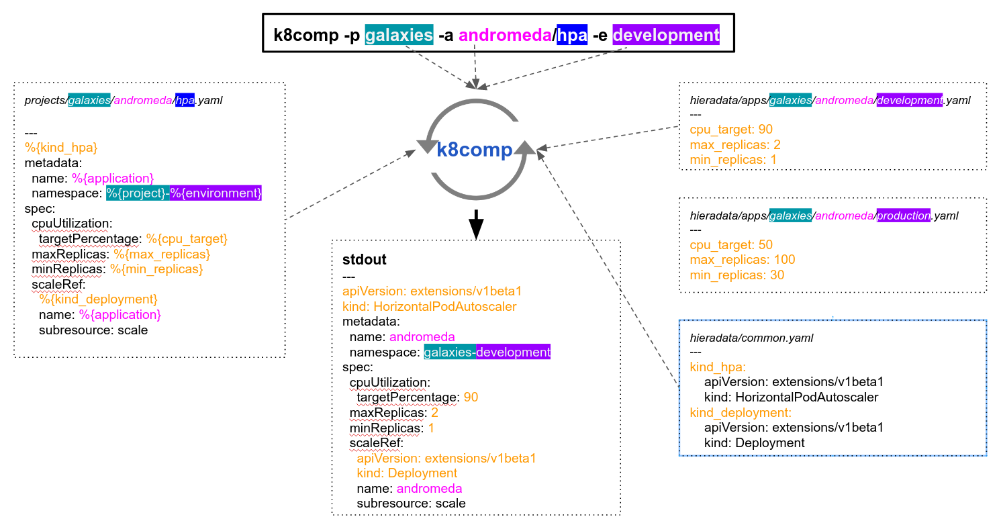

# k8comp

For more information about k8comp check https://cststack.github.io/k8comp/

## About

K8comp is a tool which substitutes any templates variables declared in the format %{VARIABLE default "DEFAULT_VALUE"} or %{VARIABLE} with values from a files hierarchy using [hiera](https://rubygems.org/gems/hiera/versions/3.2.0).
The tool was created to simplify apps deployments for Kubernetes but it can be used to template any other type of files.  

## [](#goals)Goals

- use the default yaml/json Kubernetes syntax
- to have a templates library which can be used in multiple environments and be version controlled using GIT
- have full control of all deployable resources without a complicated deployment setup
- store any secrets encrypted in a GIT repository

## Features

- support for yaml, json, yml
- encrypted variables using eyaml
- multiline variables (only for yaml files)
- auto git pull on deployment or manual git pull via ```k8comp pull```
- multi branch deployment
- support for remote templates
- use as helm plugin `helm plugin install https://github.com/cststack/k8comp`


